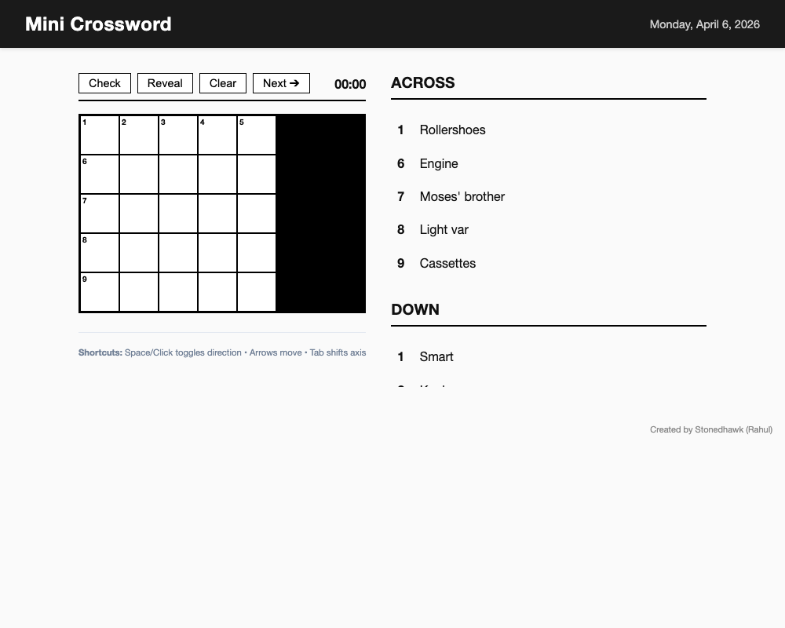

# Mini Crossword

A browser-based 5x5 Mini Crossword game built with React. Play a rotating set of daily puzzles with full keyboard interaction.

## Features
- Interactive 5x5 grid with active word highlighting
- Keyboard navigation (arrows, spacebar to toggle, tab to cycle)
- Daily puzzle rotation (5 included formats)
- Check answers and reveal full solution
- Timer tracking MM:SS format
- Fully responsive layout for desktop and mobile

## Tech Stack
- HTML5 / CSS3 / JavaScript
- React 18 & Babel via CDN
- Zero build tools required (Single File App)

## How to Play
1. [Play the Game Here](https://stonedhawk.github.io/mini-crossword)
2. Type letters to solve the clues. Arrow keys navigate around the grid. Spacebar toggles your typing direction between Across and Down.
3. Use Check to see if you have any errors, or Reveal to see the correct puzzle.

## License
MIT License. © 2026 Rahul Shah.
