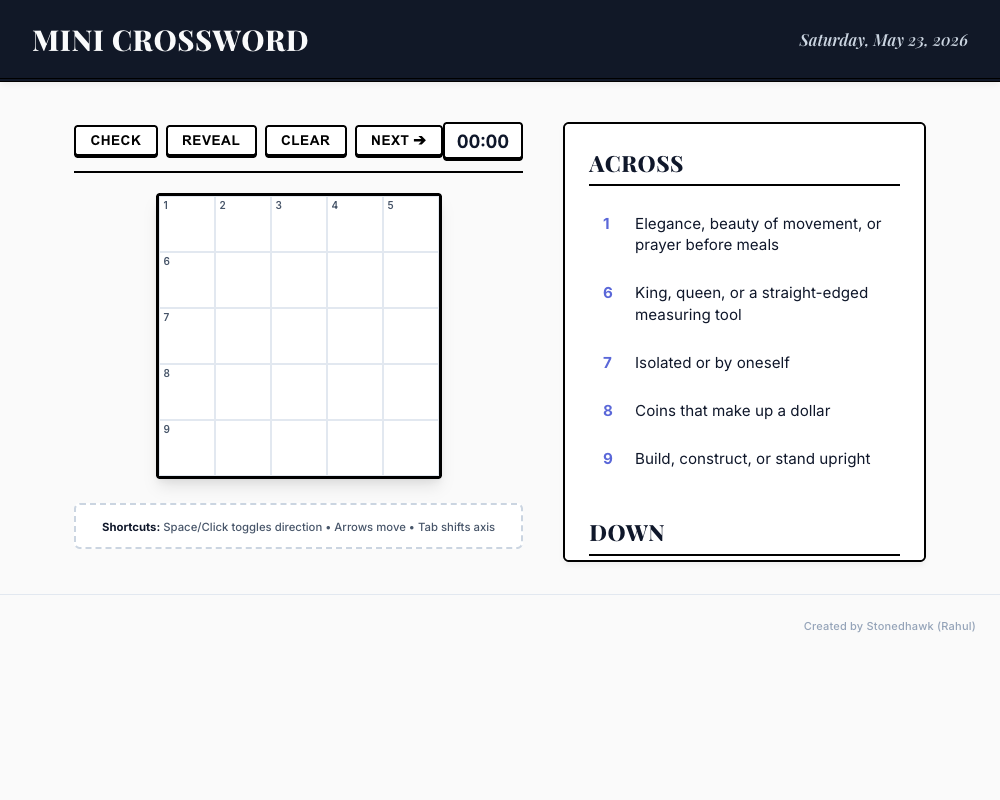

# 🧩 Mini Crossword

[](https://opensource.org/licenses/MIT)
[](https://react.dev)
[](https://github.com/stonedhawk/mini-crossword)
[](https://github.com/stonedhawk/mini-crossword)

A premium, browser-based 5x5 Mini Crossword game built with React. Play a rotating set of daily puzzles with full keyboard interaction and a beautiful newspaper-editorial aesthetic.



---

## ✨ Features

* **📰 Newspaper-Editorial Design:** Gorgeous vintage print aesthetic powered by *Playfair Display* serif typography, clean *Inter* UI styling, and a soft warm-paper background.
* **🎹 Complete Keyboard Navigation:** Intuitive arrow key movement, spacebar axes switching, and full auto-advancements when typing.
* **🧠 Curated solvalbe Puzzles:** Features 20 highly polished, 100% valid **English Word Squares** where every Across and Down word is a real, general-knowledge term. 
* **💡 High Gameplay Value:** Includes *two distinct* sets of general-knowledge clues for each puzzle (Across and Down) for maximum variety.
* **⏱️ Built-in Game Mechanics:** Full timer tracking (MM:SS format), real-time "Check Answers" error-flagging (highlights in red), and "Reveal Solution" mechanisms.
* **📲 Fully Responsive:** Perfectly optimized layout that shifts elegantly from desktop side-by-side grids to vertical mobile stacks.
* **⚡ Zero Build Pipeline:** Single file `index.html` structure leveraging CDN-loaded React and Babel. Zero configuration required to start!

---

## ⌨️ Keyboard Controls & Shortcuts

Navigate the board effortlessly like a seasoned pro:

| Key | Action |
|:---|:---|
| **`Letters (A-Z)`** | Fill current active cell and auto-advance to next cell in word |
| **`Backspace`** | Clear current cell value and move back to previous cell |
| **`Spacebar`** or **`Click Cell`** | Toggle active orientation direction (Across ⟷ Down) |
| **`Tab`** | Shift focus between Across and Down axis directions |
| **`Arrow Keys`** | Move active cell selection in any direction on the 5x5 grid |
| **`Click Clue`** | Instantly jump to the start of that word on the crossword grid |

---

## 🛠️ Tech Stack & Architecture

- **Core Framework:** React 18 & Babel (Loaded dynamically via unpkg CDNs)
- **Styling:** Premium vanilla CSS3 with responsive grid systems, tactile cartoon button effects, custom scrollbars, and fluid animations.
- **Puzzle Source:** Custom global state loaded via `puzzles.js` containing the 20 pre-solved configuration schemes.
- **E2E Testing:** Automated end-to-end headless testing suite powered by **Puppeteer** to validate input loops and CTA states.

---

## 🚀 Getting Started

### 1. Play Instantly
You can launch and play the game directly in any browser:
👉 **[Play the Live Deployed Game here](https://stonedhawk.github.io/mini-crossword)**

### 2. Run Locally
Since the game requires zero build steps, you can run it in seconds:

1. Clone the repository:
   ```bash
   git clone https://github.com/stonedhawk/mini-crossword.git
   cd mini-crossword
   ```
2. Simply double-click `index.html` to open it in your web browser, or serve it using any local server:
   ```bash
   # Using Node.js standard npx server
   npx serve .
   
   # Or using Python's built-in server
   python3 -m http.server 8000
   ```

### 3. Run Automated E2E Tests
To run the automated Puppeteer integration test suite:

1. Install developer dependencies:
   ```bash
   npm install
   ```
2. Execute the test runner:
   ```bash
   npm test
   ```

---

## 🎨 Puzzle Customization

Adding or editing puzzles is incredibly simple! Open `puzzles.js` and add a new object to the `puzzles` array following this structure:

```javascript
{
  id: 21,
  layout: [
    [0, 0, 0, 0, 0],
    [0, 0, 0, 0, 0],
    [0, 0, 0, 0, 0],
    [0, 0, 0, 0, 0],
    [0, 0, 0, 0, 0]
  ],
  answers: [
    ['W', 'O', 'R', 'D', 'S'],
    ['O', 'P', 'E', 'R', 'A'],
    ['R', 'E', 'A', 'C', 'T'],
    ['D', 'E', 'C', 'O', 'Y'],
    ['S', 'T', 'T', 'Y', 'S']
  ],
  clues: {
    across: {
      1: "Clue for Row 0",
      6: "Clue for Row 1",
      7: "Clue for Row 2",
      8: "Clue for Row 3",
      9: "Clue for Row 4"
    },
    down: {
      1: "Clue for Column 0",
      2: "Clue for Column 1",
      3: "Clue for Column 2",
      4: "Clue for Column 3",
      5: "Clue for Column 4"
    }
  }
}
```

---

## 📄 License

This project is licensed under the MIT License - see the [LICENSE](LICENSE) file for details.

Created by **Stonedhawk (Rahul Shah)**.
